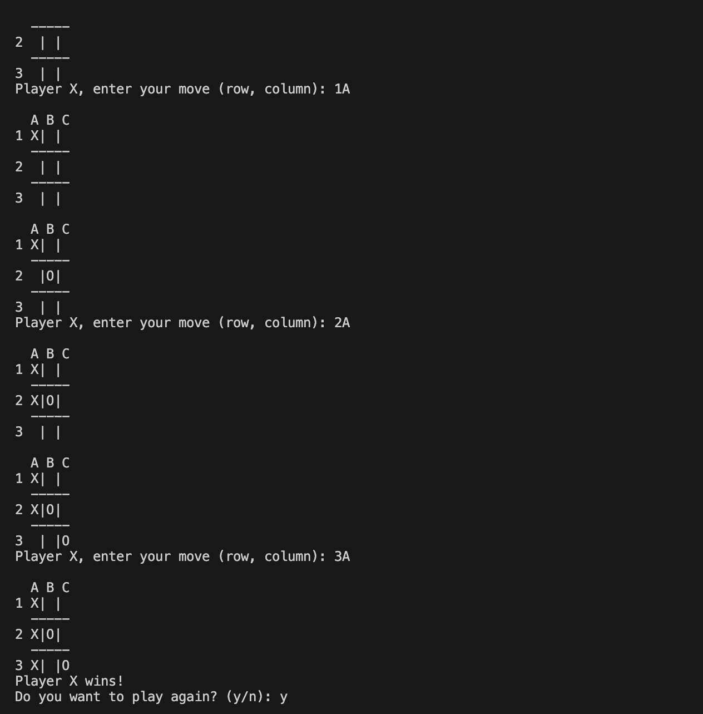

# Lab Report - Tic Tac Toe Game Board 

## CS 111- Professor Paul Hoffman

## Author - Maverick Moy and Aleia-Maelien Macatbag

## Abstract
This report presents the development and implementation of a simple Tic-Tac-Toe game using C++. The game allows a human player to compete against an AI opponent on a 3x3 grid. The program includes functions to validate user input, update the game board, and check for a winner or a tie. The AI makes random moves to any available space. The game loop enables players to play multiple rounds, with the board resetting after each game. The program ensures that the game board is displayed after each move and provides feedback on invalid moves or inputs, resulting in an engaging and functional Tic Tac Toe experience.


## Introduction
This C++ program implements a simple Tic-Tac-Toe game where a human player competes against an AI opponent. The game board is represented by a 3x3 grid, and players take turns to place their marks ('X' for the human player and 'O' for the AI) on the board. The program includes functions to display the board, check for valid moves, determine the winner, and reset the board for a new game. The AI makes random moves to any available space. After each game, the player is prompted to decide whether to play again. The game continues until the player chooses to quit.

## Code Explanation
This C++ program implements a simple Tic-Tac-Toe game where a human player competes against an AI opponent. The game board is represented by a 3x3 grid using a 2D vector of characters, with each cell initially set to an empty space (' '). The game alternates turns between the human player ('X') and the AI player ('O'). The human player is prompted to enter their move in the format of row (1, 2, or 3) and column (A, B, or C). The program includes functions to validate the input (isValidInput), convert the input to row and column indices (convertInput), check if a move is valid (isValidMove), update the board with the player's move (updateBoard), and display the current state of the board (printBoard).

The game also includes functions to check for a winner (checkWinner) by examining rows, columns, and diagonals, and to check for a tie (checkTie) by verifying if there are no empty spaces left on the board. The AI makes random moves to any available space using the easyAI function. After each move, the game checks for a winner or a tie. If a winner is found, the game announces the winner and ends. If the game is a tie, it announces the tie and ends.

The main function controls the game loop, allowing players to play multiple rounds. After each game, the player is asked if they want to play again. If the player chooses to play again, the board is reset using the resetBoard function, and the game starts anew. The game continues until the player decides to quit. The program ensures that the game board is displayed after each move and provides feedback on invalid moves or inputs. Overall, this program provides a basic yet functional implementation of a Tic-Tac-Toe game with a simple AI opponent.

## Results

The Tic Tac Toe game was successfully implemented and tested. The game correctly alternates turns between the human player and the AI, validates moves, and updates the board accordingly. The AI, using random moves, provides a simple yet effective opponent. The game accurately detects and announces the winner or a tie after each move. Players are given the option to play multiple rounds, and the board resets correctly for each new game. Overall, the program meets the requirements and provides an engaging and functional Tic Tac Toe experience.

## Discussion

During the development of the Tic Tac Toe game, several challenges were encountered. One of the primary issues was ensuring the user input was valid. Initially, the program did not handle invalid inputs gracefully, which could lead to unexpected behavior or crashes. This was resolved by implementing the isValidInput function to check the format and range of the input, and by adding input validation loops to prompt the user until a valid move was entered.

Managing the game state and alternating turns between the human player and the AI also presented difficulties. The game loop needed to accurately track the current player, update the board, and check for a winner or a tie after each move. This was achieved by implementing functions such as checkWinner, checkTie, and switchPlayer, which helped modularize the code and maintain clarity.



## Conclusion

In conclusion, this C++ program implements a simple Tic-Tac-Toe game where a human player competes against an AI opponent. The game board is represented by a 3x3 grid using a 2D vector of characters, which alternates turns between the human player ('X') and the AI player ('O'). The human player is prompted to enter their move in the format of row (1, 2, or 3) and column (A, B, or C). The program includes functions to validate the input (isValidInput), convert the input to row and column indices (convertInput), check if a move is valid (isValidMove), update the board with the player's move (updateBoard), and display the current state of the board (printBoard). The game also includes functions to check for a winner (checkWinner) by examining rows, columns, and diagonals, and to check for a tie (checkTie) by verifying if there are no empty spaces left on the board. The AI makes random moves to any available space using the easyAI function. After each move, the game checks for a winner or a tie. If a winner is found, the game announces the winner and ends. If the game is a tie, it announces the tie and ends. The main function controls the game loop, allowing players to play multiple rounds. After each game, the player is asked if they want to play again. If the player chooses to play again, the board is reset using the resetBoard function, and the game starts anew. The game continues until the player decides to quit. The program ensures that the game board is displayed after each move and provides feedback on invalid moves or inputs, providing an engaging and functional Tic Tac Toe experience.

## References

* GeeksforGeeks C++ Tutorials
https://www.geeksforgeeks.org


* Stack Overflow
https://stackoverflow.com/questions


* YouTube: 
Channels like "The Cherno" and "ProgrammingKnowledge" provide useful content.
https://www.youtube.com/@TheCherno


## Code

```cpp
#include <iostream>
#include <string>
#include <vector>

using namespace std;

// Requirments:
// 1. Implement a 3x3 Tic-Tac-Toe board game
// The board is represented by a 2D array that starts with all empty spaces
// The board is displayed as a 3x3 grid with each cell containing either an X, O, or empty space
// 2. Alternate turns between two players (X and O).
// 3a. Prompt the user for input on their move in the format of row (1,2 or 3) and column (letter A, B or C) of the move: e.g. row, column = 2B. get 1 char at a time
// 3b. check for valid and invalid input (# > 3, Letter > C) and invalid moves (e.g., preventing players from moving to an already occupied space).
// 4. Display the game board after each move.
// 5a. Check for a winner or a tie after each move.
// 5b. If the game is not over, switch players and continue the game at step 3.
// 6. Implement a function to reset the game board.
// 6. Allow players to play multiple rounds of the game, looping until the players decide to quit.
// 7. Display the final score of the game after each round.

// check if input is valid
bool isValidInput(vector<vector<char> > board, string input)
{
    if (input.length() != 2)
        return false;
    if (input[0] < '1' || input[0] > '3')
        return false;
    if (input[1] < 'A' || input[1] > 'C')
        return false;
    return true;
}

// convert input to row and column
void convertInput(vector<vector<char> > &board, char player, string input, int &row, int &col)
{
    row = input[0] - '1';
    col = input[1] - 'A';
}

// check if move is valid
// valid, space is empty
bool isValidMove(vector<vector<char> > board, int row, int col)
{
    // cout << "row: " << row << " col: " << col << "= " << board[row][col] << endl;
    if (board[row][col] == ' ')
        return true;
    return false;
}

void printBoard(vector<vector<char> > board)
{
    cout << endl << "  A B C" << endl;
    for (int i = 0; i < 3; i++)
    {
        cout << i + 1 << " ";
        for (int j = 0; j < 3; j++)
        {
            cout << board[i][j];
            if (j < 2)
                cout << "|";
        }
        cout << endl;
        if (i < 2)
            cout << "  -----" << endl;
    }
}

// update Board with player move
void updateBoard(vector<vector<char> > &board, char player, int row, int col)
{
    board[row][col] = player;
}

// get input from user
void getInput(vector<vector<char> > &board, char player)
{
    string input;
    int row, col;
    bool validInput = false;
    bool validMove = false;

    do
    {
        cout << "Player " << player << ", enter your move (row, column): ";
        cin >> input;
        if (isValidInput(board, input))
        {
            convertInput(board, player, input, row, col);
            if (isValidMove(board, row, col))
            {
                validMove = true;
            }
            else
            {
                cout << "Invalid move. Try again." << endl;
            }
        }
        else
        {
            cout << "Invalid input. Try again." << endl;
        }
    } while (!validMove);
    updateBoard(board, player, row, col);
}

bool checkWinner(vector<vector<char> > board, char player)
{
    // check rows
    for (int i = 0; i < 3; i++)
    {
        if (board[i][0] == player && board[i][1] == player && board[i][2] == player)
        {
            return true;
        }
    }
    // check columns
    for (int j = 0; j < 3; j++)
    {
        if (board[0][j] == player && board[1][j] == player && board[2][j] == player)
        {
            return true;
        }
    }
    // check diagonals
    if (board[0][0] == player && board[1][1] == player && board[2][2] == player)
    {
        return true;
    }
    if (board[0][2] == player && board[1][1] == player && board[2][0] == player)
    {
        return true;
    }
    return false;
}

// check for tie, i.e., no empty spaces left
bool checkTie(vector<vector<char> > board)
{
    for (int i = 0; i < 3; i++)
    {
        for (int j = 0; j < 3; j++)
        {
            if (board[i][j] == ' ')
            {
                return false;
            }
        }
    }
    return true;
}

// bool checkContinue();

void resetBoard(vector<vector<char> > &board)
{
    for (int i = 0; i < 3; i++)
    {
        for (int j = 0; j < 3; j++)
        {
            board[i][j] = ' ';
            // cout << i << j << endl;
        }
    }
}

// random move to any blank space
void easyAI(vector<vector<char> > &board, char player)
{
    int row, col;
    bool validMove = false;

    do
    {
        row = rand() % 3;
        col = rand() % 3;
        if (isValidMove(board, row, col))
        {
            validMove = true;
        }
    } while (!validMove);
    updateBoard(board, player, row, col);
}

int main()
{
    vector<vector<char> > board(3, vector<char>(3, ' '));
    bool playAgain = false;
    char userInput;

    do {
        // print the board
        printBoard(board);
        do
        {
            // get input from player 1
            getInput(board, 'X');
            // check for winner
            printBoard(board);
            if (checkWinner(board, 'X'))
            {
                cout << "Player X wins!" << endl;
                break;
            }
            // check for tie
            if (checkTie(board))
            {
                cout << "It's a tie!" << endl;
                break;
            }

            // get input from player 2
            // Player O is AI
            easyAI(board, 'O');
            // getInput(board, 'O');
            // check for winner
            printBoard(board);
            if (checkWinner(board, 'O'))
            {
                cout << "Player O wins!" << endl;
                break;
            }
            // // check for tie
            if (checkTie(board)) {
                cout << "It's a tie!" << endl;
                break;
            }
            // print the board

        } while (true);

        // Game over: ask to play again
        cout << "Do you want to play again? (y/n): ";
        cin >> userInput;
        if (userInput == 'y')
        {
            resetBoard(board);
            playAgain = true;
        }
        else
        {
            playAgain = false;
        }

    } while (playAgain);


    cout << "Thanks for playing!" << endl;

    return 0;
}
```
